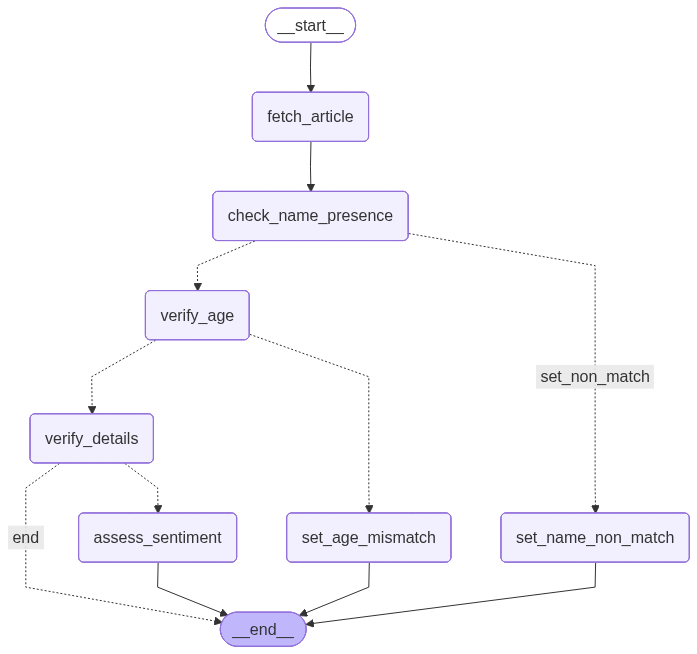

# Article Person Verification Agent with LangGraph & MLflow

This project implements an autonomous agent using **LangGraph** and Google's **Gemini** model to perform adverse media screening. The agent analyzes news articles against an applicant's details (name and DOB) to determine if it's a match and, if so, what the sentiment of the article is.

All executions are automatically logged to **MLflow**, providing a complete, traceable history of every screening decision, including the graph structure, intermediate states, and final results.

---

## 🚀 Features

* **Multi-Step Graph Logic:** Uses LangGraph to define a robust, conditional workflow with 4 verification stages
* **Age Verification:** Early filtering step to catch obvious age mismatches before detailed verification
* **Multilingual Support:** Process articles in any language (English, Spanish, French, German, Chinese, Arabic, etc.) with automatic language detection and cross-lingual name matching
* **Flexible Input Methods:** Supports both URL fetching and direct text input - paste article content directly or provide a URL
* **LLM-Powered Decisions:** Leverages Google's Gemini model for nuanced tasks like name variation matching, age verification, detail verification, and sentiment analysis
* **Automated MLflow Tracking:** Uses `mlflow.langchain.autolog()` to automatically log all graph runs with comprehensive metrics
* **Full State Logging:** Logs intermediate and final states as JSON artifacts for complete traceability and debugging
* **Batch Processing:** Run screenings for a single applicant or batch process CSV files with mixed URL/text inputs
* **Modular Architecture:** Clean separation of concerns with organized project structure

---

## 📁 Project Structure

```
Article_person_verification/
├── main.py                          # Main entry point
├── src/
│   ├── config/                      # Configuration module
│   │   ├── settings.py              # API keys, MLflow, system settings
│   │   └── prompts.py               # LLM prompts (easily editable!)
│   ├── utils/                       # Helper utilities
│   │   ├── web_scraper.py           # Article fetching logic
│   │   └── file_loader.py           # CSV/test case loading
│   └── graph/                       # LangGraph workflow
│       ├── state.py                 # State definition
│       ├── nodes.py                 # All workflow nodes
│       ├── edges.py                 # Routing logic
│       └── workflow.py              # Graph assembly
├── test_cases.csv                   # Sample test cases
├── .env                             # Environment variables
└── requirements.txt                 # Python dependencies
```

---

## ⚙️ How It Works
The agent follows a defined graph structure with conditional routing to make intelligent decisions:


### Workflow Steps

1. **`fetch_article`**: Scrapes the text content from the provided article URL using BeautifulSoup

2. **`check_name_presence`** (LLM Call 1): Scans the text to see if the applicant's name (or a clear variation like "Bill" for "William") is present

3. **Router 1**:
   * ✅ **If name found**: Proceed to `verify_age`
   * ❌ **If name not found**: Go to `set_name_non_match` → END with "Non-Match"

4. **`verify_age`** (LLM Call 2): Checks if the age/DOB mentioned in the article matches the applicant's DOB (±1 year margin)

5. **Router 2**:
   * ✅ **If age matches**: Proceed to `verify_details`
   * ❌ **If age mismatches**: Go to `set_age_mismatch` → END with "Age Mismatch - Needs Verification"

6. **`verify_details`** (LLM Call 3): Meticulously checks for Date of Birth, age, and other strong identifiers to confirm if it's the *correct person*
   * Returns: "Match", "Non-Match", or "Review Required"

7. **Router 3**:
   * ✅ **If "Match" or "Review Required"**: Proceed to `assess_sentiment`
   * ❌ **If "Non-Match"**: END

8. **`assess_sentiment`** (LLM Call 4): Analyzes the article sentiment (Positive, Negative, Neutral) concerning the applicant in a financial/regulatory context
   * Negative: lawsuits, scandals, fraud, bankruptcies, criminal activity
   * Positive: philanthropy, achievements, awards
   * Neutral: simple news reports, job changes

9. **END**: The graph finishes and returns the final state

### Decision Outcomes

- **"Match"**: High confidence it's the same person
- **"Non-Match"**: Name not found or explicit contradictory evidence
- **"Review Required"**: Name matches but insufficient identifying details
- **"Age Mismatch - Needs Verification"**: Age doesn't match (requires manual review)

---

## 🛠️ Installation

1. Clone this repository:
   ```bash
   git clone <your-repo-url>
   cd Article_person_verification
   ```

2. Install the required Python packages:
   ```bash
   pip install -r requirements.txt
   ```

   Your `requirements.txt` should include:
   ```text
   langgraph
   google-generativeai
   python-dotenv
   requests
   beautifulsoup4
   mlflow
   ```

---

## 🔑 Configuration

Create a `.env` file in the root directory:

```ini
# Your Google API Key for the Gemini model
GOOGLE_API_KEY=AIza...

# (Optional) Set a tracking server URI.
# If omitted, defaults to local './mlruns' folder
MLFLOW_TRACKING_URI=file:./mlruns
```

### Editing Prompts

All LLM prompts are centralized in [`src/config/prompts.py`](src/config/prompts.py) for easy editing:

- `NAME_PRESENCE_PROMPT` - Controls name detection logic
- `AGE_VERIFICATION_PROMPT` - Controls age matching logic
- `DETAIL_VERIFICATION_PROMPT` - Controls detailed person verification
- `SENTIMENT_ANALYSIS_PROMPT` - Controls sentiment analysis

Simply edit these prompts to customize the agent's behavior without touching any code!

---

## ▶️ Usage

The system supports **both URL-based and direct text input** for maximum flexibility.

### 1. Single Run with URL

Provide the applicant's details and article URL:

```bash
python main.py \
    --name "Bernie Madoff" \
    --dob "29/04/1938" \
    --article "https://www.reuters.com/article/..."
```

### 2. Single Run with Direct Text

Provide the article text directly (no URL needed):

```bash
python main.py \
    --name "Bernie Madoff" \
    --dob "29/04/1938" \
    --text "Bernie Madoff, 70, was sentenced to 150 years in prison for running a massive Ponzi scheme..."
```

Or use `--article` with text (system auto-detects if it's a URL or text):

```bash
python main.py \
    --name "Bernie Madoff" \
    --dob "29/04/1938" \
    --article "Bernie Madoff, 70, was sentenced to 150 years..."
```

### 3. Batch Run with URLs (Test File)

Create a `test_cases.csv` file with URLs:

```csv
name,dob,url
Bernie Madoff,29/04/1938,https://www.reuters.com/article/...
Jane Smith,12/05/1990,https://www.nytimes.com/article/...
```

### 4. Batch Run with Direct Text

Create a `test_cases.csv` file with article text:

```csv
name,dob,text
Bernie Madoff,29/04/1938,"Bernie Madoff, 70, was sentenced to 150 years in prison for running a massive Ponzi scheme that defrauded thousands of investors."
Jane Smith,12/05/1990,"Jane Smith, 33, opened a successful bakery in downtown Manhattan."
```

### 5. Mixed Batch (URLs and Text)

You can mix both in the same CSV:

```csv
name,dob,url,text
Bernie Madoff,29/04/1938,https://www.reuters.com/article/...,
Jane Smith,12/05/1990,,"Jane Smith, 33, opened a successful bakery."
```

**Note:** If both `url` and `text` columns exist, `text` takes precedence.

Then run:

```bash
python main.py
```

Or specify a custom test file:

```bash
python main.py --test_file my_cases.csv
```

---

## 📊 MLflow Tracking

This project is fully integrated with MLflow for experiment tracking and reproducibility.

### View Results

Start the MLflow UI:

```bash
mlflow ui
```

Open `http://127.0.0.1:5000` in your browser.

### What's Logged

Inside the **"Article Person Verification"** experiment, each run contains:

**Parameters:**
- `applicant_name`, `applicant_dob`, `article_url`
- `match_explanation`, `sentiment_explanation`

**Tags:**
- `match_decision` - Easy filtering by outcome
- `sentiment` - Quick sentiment overview
- `status` - COMPLETED or FAILED

**Artifacts:**
- `step_XX_<node_name>_state.json` - State after each graph step
- `run_state_history.json` - Complete execution trace
- `final_state.json` - Final graph state
- `article_text.txt` - Full article text analyzed

### Example Workflow Trace

Each step in the graph execution is logged, allowing you to see:
1. What the agent decided at each router
2. What information was extracted by each LLM call
3. How the state evolved through the workflow
4. Why the final decision was made

---

## 🌍 Multilingual Support

The system is designed to process articles in **any language** using Google's Gemini multilingual capabilities.

### Supported Languages

The system can process articles in:
- **European Languages**: English, Spanish, French, German, Italian, Portuguese, Russian, Polish, Dutch, etc.
- **Asian Languages**: Chinese (Simplified & Traditional), Japanese, Korean, Hindi, Arabic, Thai, Vietnamese, etc.
- **Other Languages**: Turkish, Hebrew, Persian, Indonesian, and many more

### How It Works

1. **Automatic Language Processing**: The LLM automatically detects and processes the article's language
2. **Cross-Lingual Name Matching**: Handles name variations across scripts (Latin, Cyrillic, Arabic, Chinese characters, etc.)
3. **Multilingual Age Detection**: Recognizes age/DOB phrases in any language (e.g., "años", "歳", "ans")
4. **Cultural Context**: Considers cultural nuances when interpreting sentiment
5. **English Output**: All analysis results are returned in English for consistency

### Example Use Cases

**Spanish Article:**
```
Article: "Bernie Madoff, de 70 años, fue condenado por fraude..."
Result: Name found ✓, Age verified ✓, Sentiment: Negative
```

**Chinese Article:**
```
Article: "伯尼·麦道夫（70岁）因欺诈被判刑..."
Result: Name found ✓, Age verified ✓, Sentiment: Negative
```

**French Article:**
```
Article: "Bernie Madoff, âgé de 70 ans, condamné pour fraude..."
Result: Name found ✓, Age verified ✓, Sentiment: Negative
```

### Configuration

No special configuration needed! The system automatically handles multilingual content.

All prompts are configured to:
- Process content in its original language
- Return responses in English
- Account for transliterations and language-specific variations
- Handle different date formats (DD/MM/YYYY, MM/DD/YYYY, etc.)

---
## 🔧 Customization

### Adding New Verification Steps

1. Add your prompt to [`src/config/prompts.py`](src/config/prompts.py)
2. Create a new node in [`src/graph/nodes.py`](src/graph/nodes.py)
3. Add routing logic in [`src/graph/edges.py`](src/graph/edges.py)
4. Update the workflow in [`src/graph/workflow.py`](src/graph/workflow.py)
5. Update state definition in [`src/graph/state.py`](src/graph/state.py) if needed

### Changing the LLM Model

Edit [`src/config/settings.py`](src/config/settings.py):

```python
GEMINI_MODEL_NAME = 'gemini-1.5-pro'  # or any other model
```

---
